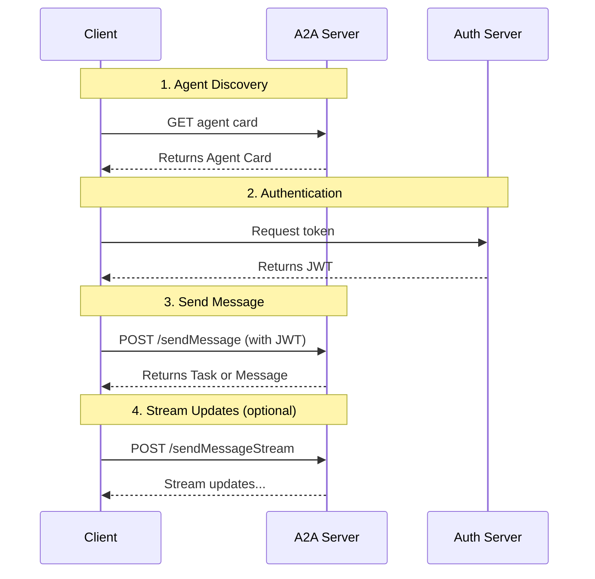

# A2A (Agent-to-Agent) Protocol: Complete Guide

## Table of Contents
1. [Introduction: What is A2A?](#introduction-what-is-a2a)
2. [The Problem A2A Solves](#the-problem-a2a-solves)
3. [Core Actors and Architecture](#core-actors-and-architecture)
4. [Fundamental Building Blocks](#fundamental-building-blocks)
5. [Agent Discovery: Finding Other Agents](#agent-discovery-finding-other-agents)
6. [Communication Flow: The Life of a Task](#communication-flow-the-life-of-a-task)
7. [Streaming and Asynchronous Operations](#streaming-and-asynchronous-operations)
8. [Extensions: Customizing A2A](#extensions-customizing-a2a)
9. [Enterprise Features](#enterprise-features)
10. [A2A vs MCP: Understanding the Difference](#a2a-vs-mcp-understanding-the-difference)
11. [How Everything Connects](#how-everything-connects)

---

## Introduction: What is A2A?

**A2A (Agent-to-Agent)** is an **open standard protocol** that enables AI agents to communicate and collaborate with each other, regardless of:
- Which framework they were built with (LangGraph, CrewAI, ADK, etc.)
- Which organization owns them
- Which LLM powers them

Think of A2A as the "universal language" for AI agents—like HTTP for web servers, but specifically designed for agent collaboration.

### Key Design Principles

1. **Simplicity**: Uses existing standards (HTTP, JSON-RPC, Server-Sent Events)
2. **Enterprise Readiness**: Built-in security, authentication, monitoring
3. **Asynchronous**: Handles long-running tasks naturally
4. **Modality Independent**: Supports text, images, files, structured data
5. **Opaque Execution**: Agents don't expose their internal workings to each other

---

## The Problem A2A Solves

### Scenario: Planning an International Trip

Imagine you ask an AI assistant to "plan an international trip." This requires:
- ✈️ A **Flight Booking Agent**
- 🏨 A **Hotel Reservation Agent**
- 💱 A **Currency Conversion Agent**
- 🚌 A **Local Tours Agent**

### Without A2A:
- Each agent has its own bespoke development
- Custom integrations needed for each pair of agents
- Agents can't discover what others can do
- Security is inconsistent
- Scaling is a nightmare
- Agents must be "wrapped as tools," losing their autonomy

### With A2A:
- All agents speak the same standardized protocol
- Agents discover each other's capabilities automatically
- Secure communication over HTTPS
- Agents maintain their autonomy and can negotiate directly
- Easy to add new agents to the ecosystem

---

## Core Actors and Architecture

### The Three Key Players

```
┌──────────┐
│   USER   │  (Human or automated service)
└────┬─────┘
     │
     ▼
┌─────────────────┐
│  A2A CLIENT     │  (Client Agent or Application)
│  (Agent A)      │  - Initiates communication
└────┬────────────┘  - Acts on behalf of user
     │
     │ A2A Protocol (HTTPS)
     │
     ▼
┌─────────────────┐
│  A2A SERVER     │  (Remote Agent)
│  (Agent B)      │  - Exposes HTTP endpoint
└─────────────────┘  - Processes tasks
                     - Returns results
```

### Important Concepts

- **Client Agent**: The agent that initiates communication (makes requests)
- **Server Agent**: The remote agent that receives requests and does work
- **Opaque**: Server agents are "black boxes"—clients can't see their internal memory, tools, or logic
- **Peer-to-Peer**: Agents collaborate as equals, not in a strict hierarchy

---

## Fundamental Building Blocks

### 1. Agent Card 🪪

A **JSON metadata document** that describes an agent—like a business card.

**Contains:**
- **Identity**: Name, description, provider
- **Endpoint URL**: Where to send requests
- **Capabilities**: What it can do (streaming, push notifications, extensions)
- **Authentication**: How to authenticate (OAuth, Bearer tokens, API keys)
- **Skills**: Detailed list of what tasks it can perform

**Purpose:** Enables discovery and tells clients how to interact securely.

**Example:**
```json
{
  "name": "Flight Booking Agent",
  "description": "Books flights worldwide",
  "url": "https://flights.example.com/a2a",
  "capabilities": {
    "streaming": true,
    "pushNotifications": false
  },
  "security": {
    "schemes": ["Bearer"]
  },
  "skills": [
    {
      "id": "book-flight",
      "name": "Book Flight",
      "description": "Search and book flights"
    }
  ]
}
```

---

### 2. Task 📋

A **stateful unit of work** with a unique ID and lifecycle.

**Key Properties:**
- **taskId**: Unique identifier
- **contextId**: Groups related tasks together
- **status**: Current state (working, completed, failed, etc.)
- **artifacts**: Tangible outputs (documents, images, data)
- **messages**: Conversational turns

**Purpose:** Tracks long-running operations and multi-turn interactions.

**Task States:**
- `submitted`: Task received and queued
- `working`: Agent is processing
- `input-required`: Agent needs more information
- `auth-required`: Agent needs additional credentials
- `completed`: Task finished successfully
- `failed`: Task encountered an error
- `canceled`: Task was canceled
- `rejected`: Agent rejected the task

---

### 3. Message 💬

A **single turn of communication** between agents.

**Contains:**
- **role**: Either "user" or "agent"
- **messageId**: Unique identifier
- **parts**: The actual content (text, files, data)
- **contextId**: Links to ongoing conversation
- **referenceTaskIds**: References previous tasks

**Purpose:** Conveys instructions, questions, answers, status updates.

---

### 4. Part 📦

The **fundamental content container** used in messages and artifacts.

**Types:**
- **TextPart**: Plain text content
  ```json
  {
    "kind": "text",
    "text": "Book a flight to Helsinki"
  }
  ```

- **FilePart**: Files (images, PDFs, etc.)
  ```json
  {
    "kind": "file",
    "file": {
      "name": "boarding_pass.pdf",
      "mimeType": "application/pdf",
      "bytes": "base64_encoded_data..."
    }
  }
  ```

- **DataPart**: Structured JSON data
  ```json
  {
    "kind": "data",
    "data": {
      "departureDate": "2025-12-01",
      "destination": "HEL"
    }
  }
  ```

**Purpose:** Provides flexibility for exchanging different content types.

---

### 5. Artifact 🎨

A **tangible output** generated by an agent during task processing.

**Properties:**
- **artifactId**: Unique identifier
- **name**: Human-readable name
- **description**: What it contains
- **parts**: One or more Part objects

**Purpose:** Delivers concrete results of an agent's work.

**Example:** A completed flight booking confirmation, an image, a report, structured data.

---

### 6. Context (contextId) 🔗

A **server-generated identifier** that groups related tasks and messages.

**Purpose:**
- Provides continuity across multiple interactions
- Enables multi-turn conversations
- Maintains shared session state
- Allows parallel tasks within the same "conversation"

**Example Flow:**
1. User: "Plan a trip to Finland" → Agent creates `contextId: ctx-abc`
2. User: "Book the cheapest flight" (uses `ctx-abc`) → Creates `task-1`
3. User: "Also book a hotel near the airport" (uses `ctx-abc`) → Creates `task-2`
4. User: "Make the hotel reservation for 3 nights" (uses `ctx-abc`, references `task-2`) → Creates `task-3`

All tasks share the same context but can progress independently.

---

## Agent Discovery: Finding Other Agents

Before agents can collaborate, they need to **find each other** and understand what each can do.

### Strategy 1: Well-Known URI (Recommended for Public Agents)

Agents host their **Agent Card** at a standard location:
```
https://{agent-domain}/.well-known/agent-card.json
```

**Process:**
1. Client knows or discovers the domain (e.g., `flights.example.com`)
2. Client makes GET request to `https://flights.example.com/.well-known/agent-card.json`
3. Server returns the Agent Card

**Advantages:** Simple, follows web standards, enables automated discovery.

---

### Strategy 2: Curated Registries (Catalog-Based)

A **central registry** (like an app store) maintains Agent Cards.

**Process:**
1. Agents publish their cards to the registry
2. Clients query the registry (e.g., "find agents that can book flights")
3. Registry returns matching Agent Cards

**Advantages:** 
- Centralized management
- Capability-based search
- Access controls and governance
- Works for private and public marketplaces

---

### Strategy 3: Direct Configuration (Private/Development)

Agents are **hardcoded** or configured directly.

**Process:** Use config files, environment variables, or proprietary APIs.

**Advantages:** Simple for known, static relationships.

**Disadvantages:** Inflexible, requires reconfiguration for changes.

---

### Security: Protecting Agent Cards

Agent Cards may contain sensitive information. Protection mechanisms:

- **Authenticated Extended Cards**: Require authentication to access detailed info
- **Secure Endpoints**: Use mTLS, OAuth, network restrictions
- **Selective Disclosure**: Show different info based on who's asking

---

## Communication Flow: The Life of a Task

### Request Lifecycle Overview



---

### Message vs Task: When to Use Which?

#### Agents Can Respond in Two Ways:

**1. With a Message** (Stateless, immediate)
- For simple, transactional interactions
- No complex state management needed
- Example: Quick Q&A, simple lookups

**2. With a Task** (Stateful, tracked)
- For long-running operations
- When tracking progress is important
- When multiple steps are involved
- Example: Booking a flight, generating a report

#### Three Agent Patterns:

**Message-Only Agents:**
- Always respond with Messages
- Simple, stateless
- Like a chatbot with tools

**Task-Generating Agents:**
- Always respond with Tasks
- Even simple responses create completed tasks
- Strict, consistent tracking

**Hybrid Agents (Most Common):**
- Use Messages to negotiate and clarify
- Create Tasks once scope is clear
- Best balance of flexibility and tracking

---

### Task Immutability: A Crucial Concept

**Rule:** Once a task reaches a terminal state (completed, failed, canceled), it **cannot restart**.

**Why?**
- Clean mapping of inputs to outputs
- Reliable references to tasks and artifacts
- Easier implementation for developers
- Clear traceability

**Follow-ups and Refinements:**
Instead of restarting a task, create a **new task** with the same `contextId` and reference the original task.

**Example:**
```json
// Task 1: Generate sailboat image (completed)
{
  "id": "task-1",
  "contextId": "ctx-abc",
  "status": { "state": "completed" },
  "artifacts": [
    {
      "artifactId": "artifact-1",
      "name": "sailboat_image.png"
    }
  ]
}

// Task 2: Make the boat red (new task, same context)
{
  "id": "task-2",
  "contextId": "ctx-abc",  // Same context
  "referenceTaskIds": ["task-1"],  // References previous
  "status": { "state": "completed" },
  "artifacts": [
    {
      "artifactId": "artifact-2",
      "name": "sailboat_image.png"  // Same name, new artifact
    }
  ]
}
```

---

### Parallel Tasks: Doing Multiple Things at Once

A2A supports **parallel work** within the same context.

**Example: Trip Planning**
1. **Task 1**: Book a flight to Helsinki
2. **Task 2**: Based on Task 1, book a hotel
3. **Task 3**: Based on Task 1, book a snowmobile activity
4. **Task 4**: Based on Task 2, add spa to hotel booking

Tasks 2 and 3 can run in parallel (both depend only on Task 1). Task 4 starts after Task 2 completes.

---

### Interaction Mechanisms

#### 1. Request/Response (Polling)

Client sends a message, server responds. For long tasks, client polls for updates.

```
Client → Server: "Book a flight"
Server → Client: Task created (status: working)
[Time passes]
Client → Server: "What's the status?"
Server → Client: Task completed
```

**Use when:** Simple, occasional status checks are enough.

---

#### 2. Streaming with SSE (Server-Sent Events)

Real-time updates over an open HTTP connection.

```
Client → Server: "Generate a long report" (streaming enabled)
Server → Client: Task submitted
Server → Client: Status update (working)
Server → Client: Artifact chunk 1
Server → Client: Artifact chunk 2
Server → Client: Status update (completed)
```

**Use when:** You want real-time progress, partial results, or low-latency updates.

**Server must declare:** `capabilities.streaming: true` in Agent Card.

---

#### 3. Push Notifications (Webhooks)

Server actively notifies client at significant events.

```
Client → Server: "Process this huge dataset" (with webhook URL)
[Hours pass, client disconnects]
Server → Client's Webhook: "Task completed, check results"
Client → Server: "Get task details"
```

**Use when:** Very long tasks (minutes to days), client can't stay connected.

**Server must declare:** `capabilities.pushNotifications: true` in Agent Card.

---

## Streaming and Asynchronous Operations

### Why Async Matters

AI agents often:
- Take time to process (seconds to hours)
- Produce incremental results
- Need human input mid-task
- Require access to external systems

A2A is built from the ground up to handle these scenarios elegantly.

---

### Server-Sent Events (SSE) in Detail

**Mechanism:**
1. Client uses `message/stream` RPC method
2. Server responds with `Content-Type: text/event-stream`
3. Connection stays open
4. Server pushes events as they happen

**Event Types:**
- **Task**: Current state of the work
- **TaskStatusUpdateEvent**: State changes (working → completed)
- **TaskArtifactUpdateEvent**: New or updated artifacts
  - Can be sent in chunks with `append` and `lastChunk` flags

**Stream Termination:**
- Server sets `final: true` when done
- Connection closes

**Reconnection:**
- If connection breaks, client can reconnect with `tasks/resubscribe`

---

### Push Notifications in Detail

**Configuration:**
Client provides a `PushNotificationConfig`:
```json
{
  "url": "https://client.example.com/webhook",
  "token": "client-validation-token",
  "authentication": {
    "schemes": ["Bearer"],
    "token": "server-auth-token"
  }
}
```

**Security Considerations:**

**For A2A Server (sending notifications):**
- **Validate webhook URLs** (prevent SSRF attacks)
- **Authenticate to client's webhook** (use Bearer tokens, HMAC, mTLS)

**For Client Webhook (receiving notifications):**
- **Verify authenticity** (check signatures, validate JWTs)
- **Prevent replay attacks** (check timestamps, use nonces)
- **Secure key management** (rotate keys regularly)

**Best Practice: Asymmetric Keys (JWT + JWKS)**
1. Server signs notifications with private key
2. Server publishes public keys at JWKS endpoint
3. Client fetches public key and verifies signature

---

## Extensions: Customizing A2A

**Extensions** let you add custom functionality to A2A without fragmenting the standard.

### What Extensions Can Do

1. **Data-only Extensions**: Add metadata to Agent Cards
   - Example: GDPR compliance info

2. **Profile Extensions**: Add structure to messages
   - Example: Require specific data formats

3. **Method Extensions**: Add new RPC methods
   - Example: `tasks/search` to query task history

4. **State Machine Extensions**: Add new task states
   - Example: New sub-states like "generating-image"

### Extension Declaration

In Agent Card:
```json
{
  "capabilities": {
    "extensions": [
      {
        "uri": "https://example.com/ext/secure-passport/v1",
        "description": "Trusted user context for personalization",
        "required": false,
        "params": {
          "supportedIdProviders": ["google", "microsoft"]
        }
      }
    ]
  }
}
```

### Extension Activation

**Process:**
1. Client includes extension URIs in `X-A2A-Extensions` HTTP header
2. Server activates supported extensions
3. Server echoes activated extensions in response header

**Example Request:**
```http
POST /sendMessage HTTP/1.1
X-A2A-Extensions: https://example.com/ext/secure-passport/v1
Content-Type: application/json
...
```

**Example Response:**
```http
HTTP/1.1 200 OK
X-A2A-Extensions: https://example.com/ext/secure-passport/v1
Content-Type: application/json
...
```

### Required Extensions

- `required: true` means clients **must** support it to interact
- Use sparingly (only for fundamental functionality)
- Agents should reject requests that don't honor required extensions

### Example Extensions

- **Secure Passport**: Trusted user context
- **Traceability**: Distributed tracing support
- **Agent Gateway Protocol (AGP)**: Routing and squad coordination

---

## Enterprise Features

A2A is designed to fit into existing enterprise infrastructure, not replace it.

### Transport Security (TLS)

- **Mandatory HTTPS** in production
- Use **TLS 1.2 or higher**
- Verify server certificates (prevent MITM attacks)

---

### Authentication

**Principle:** Authentication happens at HTTP layer, NOT in A2A payloads.

**Process:**
1. Agent Card declares authentication schemes (OAuth2, Bearer, API Key)
2. Client obtains credentials **out-of-band** (OAuth flows, secure distribution)
3. Client sends credentials in **HTTP headers** (e.g., `Authorization: Bearer <token>`)
4. Server validates every request

**Responses:**
- `401 Unauthorized`: Missing or invalid credentials
- `403 Forbidden`: Valid credentials, but insufficient permissions

**In-Task Authentication:**
If an agent needs additional credentials during a task (e.g., to access user's Google Drive):
1. Agent returns `status.state: "auth-required"`
2. Client obtains credentials through OAuth flow
3. Client sends credentials back to continue task

---

### Authorization

After authentication, server decides **what the client can do**.

**Best Practices:**
- **Granular control**: Per-user, per-skill permissions
- **Skill-based**: OAuth scopes for specific skills
- **Data-level**: Enforce permissions on underlying resources
- **Least privilege**: Grant only necessary permissions

---

### Data Privacy

- **Compliance**: GDPR, CCPA, HIPAA as applicable
- **Data minimization**: Only exchange necessary information
- **Secure handling**: Encrypt in transit (TLS) and at rest

---

### Tracing, Observability, Monitoring

**Distributed Tracing:**
- Use OpenTelemetry and W3C Trace Context headers
- Propagate trace IDs across agent calls
- Enable end-to-end debugging

**Comprehensive Logging:**
- Log taskId, contextId, correlation IDs
- Include trace context for troubleshooting

**Metrics:**
- Request rates, error rates
- Task latency, resource usage
- Enable alerting and capacity planning

**Auditing:**
- Log task creation, state changes
- Track sensitive operations

---

### API Management

For external or cross-organization A2A servers:
- **Policy enforcement**: Centralized security policies
- **Traffic management**: Load balancing, rate limiting
- **Analytics**: Usage insights and trends
- **Developer portals**: Documentation and onboarding

---

## A2A vs MCP: Understanding the Difference

### What is MCP?

**Model Context Protocol (MCP)** is a protocol for connecting AI agents to **tools and resources**.

**Use cases:**
- LLM calling an external API
- Agent querying a database
- Agent using predefined functions

**Characteristics of Tools:**
- Well-defined inputs/outputs
- Stateless operations
- Specific functions (calculator, weather lookup, file search)

---

### What is A2A?

**Agent-to-Agent Protocol (A2A)** is for enabling **agents to collaborate** with each other.

**Use cases:**
- Customer service agent delegating to billing agent
- Travel agent coordinating with flight, hotel, tour agents
- Research agent consulting with data analysis agent

**Characteristics of Agents:**
- Autonomous systems with reasoning
- Maintain state over interactions
- Use multiple tools internally
- Engage in multi-turn dialogues

---

### The Key Distinction

| Aspect | MCP (Agent ↔ Tool) | A2A (Agent ↔ Agent) |
|--------|-------------------|---------------------|
| **What** | Connects agents to resources | Connects agents to agents |
| **Interaction** | Simple function calls | Complex conversations |
| **State** | Usually stateless | Stateful, long-running |
| **Autonomy** | Tools are primitives | Agents are autonomous |
| **Complexity** | Structured I/O | Multi-turn negotiation |

---

### A2A ❤️ MCP: Better Together

**They're complementary, not competing!**

```
┌──────────┐
│   USER   │
└────┬─────┘
     │
     ▼ A2A
┌─────────────┐
│  AGENT A    │ ← Primary orchestrator
└─────┬───────┘
      │
      ├─ A2A ──→ ┌─────────────┐
      │          │  AGENT B    │ ← Remote specialist agent
      │          └─────┬───────┘
      │                │
      │                ├─ MCP ──→ [Tool 1: Database]
      │                └─ MCP ──→ [Tool 2: API]
      │
      └─ MCP ──→ [Tool 3: Calculator]
```

**Example: Auto Repair Shop**

1. **Customer → Shop Manager** (A2A)
   - "My car is making a rattling noise"

2. **Shop Manager → Mechanic Agent** (A2A)
   - Multi-turn diagnostic conversation
   - "Can you send a video?" / "How long has this been happening?"

3. **Mechanic Agent → Tools** (MCP)
   - `scan_vehicle_for_error_codes(vehicle_id='XYZ123')`
   - `get_repair_procedure(error_code='P0300')`
   - `raise_platform(height_meters=2)`

4. **Mechanic Agent → Parts Supplier Agent** (A2A)
   - "Do you have part #12345 in stock?"

---

### Summary

- **Use MCP** when an agent needs to interact with a specific tool or resource
- **Use A2A** when agents need to collaborate as peers on complex tasks
- **Use both** in real-world agentic systems for maximum capability

---

## How Everything Connects

Let me tie all these concepts together with a complete example.

### End-to-End Example: International Trip Planning

#### Phase 1: Discovery

```
1. User tells AI Assistant: "Plan a trip to Finland"

2. AI Assistant (Client) discovers available agents:
   - GET https://flights.example.com/.well-known/agent-card.json
   - GET https://hotels.example.com/.well-known/agent-card.json
   - GET https://tours.example.com/.well-known/agent-card.json

3. AI Assistant reads Agent Cards:
   - Learns what skills each agent has
   - Learns how to authenticate
   - Learns if they support streaming
```

#### Phase 2: Authentication

```
4. AI Assistant obtains OAuth tokens:
   - For Flight Agent: token_flight_123
   - For Hotel Agent: token_hotel_456
   - For Tours Agent: token_tours_789
```

#### Phase 3: Task Execution (with contextId)

```
5. AI Assistant → Flight Agent (creates contextId)
   POST /sendMessage
   Authorization: Bearer token_flight_123
   {
     "message": {
       "role": "user",
       "parts": [{"kind": "text", "text": "Find flights to Helsinki in December"}]
     }
   }
   
   Response:
   {
     "kind": "task",
     "id": "task-flight-1",
     "contextId": "ctx-trip-finland-abc",  ← New context created
     "status": {"state": "working"}
   }

6. Flight Agent streams updates (SSE)
   - Event: TaskStatusUpdateEvent (searching...)
   - Event: TaskArtifactUpdateEvent (found 5 flights)
   - Event: TaskStatusUpdateEvent (completed)
   
   Final Artifact:
   {
     "artifactId": "artifact-flights",
     "name": "helsinki_flights.json",
     "parts": [{
       "kind": "data",
       "data": {
         "flights": [
           {"id": "FL123", "price": 450, "departure": "2025-12-15"}
         ]
       }
     }]
   }

7. AI Assistant → Flight Agent (refinement in same context)
   POST /sendMessage
   {
     "message": {
       "role": "user",
       "contextId": "ctx-trip-finland-abc",  ← Same context
       "referenceTaskIds": ["task-flight-1"],  ← References previous task
       "parts": [{"kind": "text", "text": "Book the cheapest flight"}]
     }
   }
   
   Response:
   {
     "kind": "task",
     "id": "task-flight-2",  ← New task
     "contextId": "ctx-trip-finland-abc",  ← Same context
     "status": {"state": "input-required"},
     "messages": [{
       "role": "agent",
       "parts": [{"kind": "text", "text": "I need your passport number"}]
     }]
   }

8. AI Assistant → Flight Agent (provide input)
   POST /sendMessage
   {
     "message": {
       "role": "user",
       "contextId": "ctx-trip-finland-abc",
       "taskId": "task-flight-2",
       "parts": [{"kind": "text", "text": "Passport: AB123456"}]
     }
   }
   
   Response:
   {
     "kind": "task",
     "id": "task-flight-2",
     "contextId": "ctx-trip-finland-abc",
     "status": {"state": "completed"},
     "artifacts": [{
       "artifactId": "artifact-booking",
       "name": "flight_confirmation.pdf"
     }]
   }

9. Parallel Tasks: Hotel and Tours (both reference flight booking)
   
   AI Assistant → Hotel Agent:
   {
     "message": {
       "contextId": "ctx-trip-finland-abc",  ← Same context
       "referenceTaskIds": ["task-flight-2"],
       "parts": [{"kind": "text", "text": "Book hotel near airport"}]
     }
   }
   → Creates task-hotel-1
   
   AI Assistant → Tours Agent:
   {
     "message": {
       "contextId": "ctx-trip-finland-abc",  ← Same context
       "referenceTaskIds": ["task-flight-2"],
       "parts": [{"kind": "text", "text": "Book snowmobile tour"}]
     }
   }
   → Creates task-tours-1
   
   Both tasks run in parallel!

10. Final refinement: Modify hotel
    AI Assistant → Hotel Agent:
    {
      "message": {
        "contextId": "ctx-trip-finland-abc",  ← Same context
        "referenceTaskIds": ["task-hotel-1"],
        "parts": [{"kind": "text", "text": "Add spa package"}]
      }
    }
    → Creates task-hotel-2
```

#### Phase 4: Monitoring and Observability

```
All requests include tracing headers:
- traceparent: 00-{trace-id}-{span-id}-01
- Enables end-to-end debugging across all agents
```

#### Summary of Context Usage

```
Context: ctx-trip-finland-abc
├── task-flight-1 (search flights) → completed
├── task-flight-2 (book flight) → completed
├── task-hotel-1 (book hotel) → completed
├── task-hotel-2 (add spa) → completed
└── task-tours-1 (book tour) → completed

All tasks share the same context but are tracked independently.
The context provides conversational continuity.
```

---

### Key Takeaways from This Example

1. **Agent Cards** enable discovery (Phase 1)
2. **Authentication** happens at HTTP layer (Phase 2)
3. **Context ID** ties related tasks together (Phase 3)
4. **Tasks** track individual units of work (Phase 3)
5. **Task immutability** means refinements create new tasks (Phase 3)
6. **Parallel execution** within same context is supported (Phase 3)
7. **Messages** enable negotiation before committing to tasks (Phase 3)
8. **Streaming** provides real-time updates (Phase 3)
9. **Tracing** enables observability across agents (Phase 4)

---

## Conclusion: The Complete Picture

### The A2A Ecosystem

```
┌─────────────────────────────────────────────────────────┐
│                    AGENTIC SYSTEM                       │
├─────────────────────────────────────────────────────────┤
│                                                         │
│  ┌──────────────┐                                      │
│  │ USER/CLIENT  │                                      │
│  └──────┬───────┘                                      │
│         │                                               │
│         │ A2A Protocol                                  │
│         ▼                                               │
│  ┌──────────────────────────────────────────┐         │
│  │         ORCHESTRATOR AGENT               │         │
│  │  (uses LangGraph, LangChain, ADK)       │         │
│  └──┬───────────────────────────────────┬───┘         │
│     │                                   │              │
│     │ A2A                              │ MCP          │
│     │                                   │              │
│     ▼                                   ▼              │
│  ┌─────────────┐              ┌──────────────┐       │
│  │   AGENT 2   │              │    TOOLS     │       │
│  │  (Remote)   │              │ - Database   │       │
│  └──────┬──────┘              │ - APIs       │       │
│         │                      │ - Functions  │       │
│         │ MCP                  └──────────────┘       │
│         ▼                                              │
│    ┌─────────┐                                        │
│    │  TOOLS  │                                        │
│    └─────────┘                                        │
│                                                         │
│  Extensions: Custom functionality                      │
│  Tracing: OpenTelemetry throughout                    │
│  Security: TLS + OAuth2 + Authorization               │
│                                                         │
└─────────────────────────────────────────────────────────┘
```

### The Core Concepts Pyramid

```
                 ┌─────────────────┐
                 │   EXTENSIONS    │  ← Customize behavior
                 └────────┬────────┘
                          │
              ┌───────────┴───────────┐
              │  INTERACTION MODES    │  ← How agents communicate
              │ Polling, SSE, Webhook │
              └───────────┬───────────┘
                          │
          ┌───────────────┴───────────────┐
          │    TASK LIFECYCLE             │  ← State management
          │  Messages, Tasks, Artifacts   │
          └───────────────┬───────────────┘
                          │
      ┌───────────────────┴───────────────────┐
      │      FUNDAMENTAL BUILDING BLOCKS      │  ← Data structures
      │ Agent Card, Task, Message, Part, etc. │
      └───────────────────┬───────────────────┘
                          │
  ┌───────────────────────┴───────────────────────┐
  │          CORE ARCHITECTURE                    │  ← Actors & roles
  │    Client Agent ←→ Server Agent (over HTTP)   │
  └───────────────────────────────────────────────┘
```

### What You've Learned

1. **What A2A is**: A standardized protocol for agent collaboration
2. **Why it exists**: To break down silos and enable interoperability
3. **Who the actors are**: Client agents, server agents, users
4. **Core building blocks**: Agent Cards, Tasks, Messages, Parts, Artifacts, Context
5. **Discovery**: How agents find each other (well-known URIs, registries)
6. **Communication**: Message vs Task, context management, task lifecycle
7. **Async operations**: Polling, streaming (SSE), push notifications
8. **Extensions**: How to customize A2A without fragmenting the standard
9. **Enterprise features**: Security, auth, monitoring, compliance
10. **A2A vs MCP**: Complementary protocols for different needs

---

## Next Steps

Now that you understand A2A conceptually:

1. **Read the Tutorial folder** to learn implementation details
2. **Study the Specification** for technical details
3. **Build a simple agent** using Python and the A2A SDK
4. **Experiment with multi-agent systems** combining LangGraph, MCP, and A2A

You're now ready to build your first multi-agent system! 🚀

---

## Quick Reference

### Key URLs
- Agent Card: `/.well-known/agent-card.json`
- Send Message: `POST /sendMessage`
- Stream Message: `POST /sendMessageStream`
- Get Task: `GET /tasks/{taskId}`
- Subscribe: `POST /tasks/subscribe`

### Key Headers
- `Authorization: Bearer <token>` - Authentication
- `X-A2A-Extensions: uri1,uri2` - Extension activation
- `Content-Type: application/json` - Request format
- `Content-Type: text/event-stream` - SSE response

### Key States
- `submitted` → `working` → `completed`
- `input-required` - Need more info
- `auth-required` - Need credentials
- `failed` - Error occurred
- `canceled` - User canceled
- `rejected` - Agent rejected

### Remember
- **Context ID** groups related work
- **Task ID** tracks specific work units
- **Tasks are immutable** once complete
- **Agents are opaque** (black boxes)
- **Security is paramount** (TLS + Auth)
- **A2A + MCP = Complete solution**
